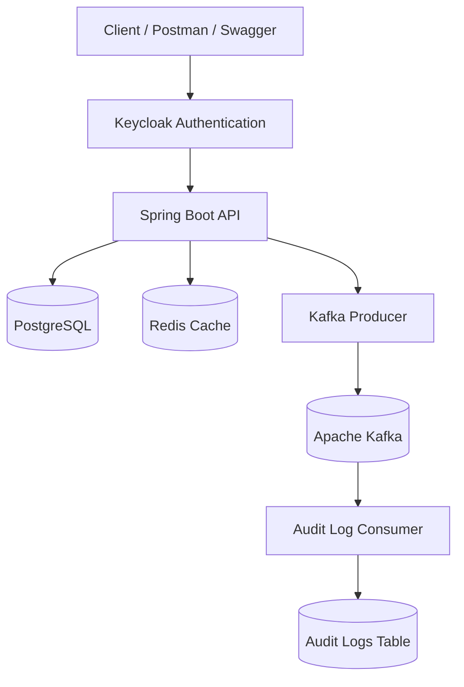
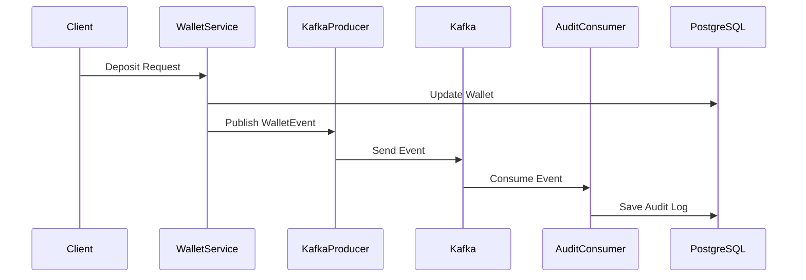
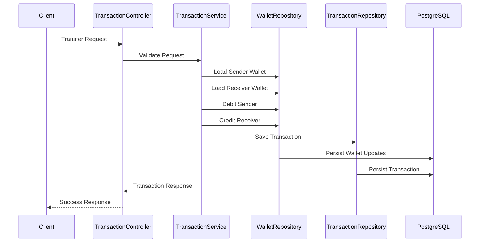

# Enterprise Digital Wallet Platform

Enterprise Digital Wallet Platform is a production-style backend application built using Spring Boot and PostgreSQL.

The project simulates a real-world digital wallet/payment system with support for:

- User onboarding
- Wallet management
- Deposits and withdrawals
- Peer-to-peer money transfers
- Transaction history tracking
- Kafka event-driven audit logging
- Redis caching
- Keycloak OAuth2 authentication
- Validation and exception handling
- Dockerized local development

The primary goal of this project is to demonstrate enterprise backend engineering concepts using modern Java backend technologies and production-oriented architecture patterns.

---

# Tech Stack

## Backend

- Java 21
- Spring Boot
- Spring Web
- Spring Data JPA
- Hibernate ORM
- Spring Security
- OAuth2 Resource Server
- Maven

## Database

- PostgreSQL

## Infrastructure

- Docker
- Docker Compose
- Apache Kafka
- Redis
- Keycloak

## Utilities

- Lombok
- Bean Validation
- OpenAPI / Swagger

---

# Current Enterprise Features

## User Module

- Create user
- Fetch user by ID
- Fetch all users

## Wallet Module

- Automatic wallet creation
- Fetch wallet by user ID
- Deposit money
- Withdraw money
- Balance validation

## Transaction Module

- Transfer money between users
- Transaction history by user
- Fetch transaction by ID
- Unique transaction reference numbers
- Transaction status tracking
- Transaction type tracking

## Audit Log Module

- Kafka-based event consumption
- Wallet event tracking
- Deposit audit logs
- Withdrawal audit logs
- Transaction event persistence
- Event timestamps

## Security Features

- Keycloak OAuth2 authentication
- JWT-based authorization
- Role-based secured APIs
- Stateless authentication

## Platform Features

- Redis wallet caching
- Kafka event publishing
- Kafka event consumption
- Audit logging system
- Global exception handling
- Request validation
- DTO-based architecture
- Layered service architecture
- PostgreSQL persistence
- Dockerized development setup

---

# Planned Enterprise Features

The project roadmap includes:

- Elasticsearch transaction search
- Netflix Conductor workflows
- Jenkins CI/CD pipeline
- Kubernetes deployment
- Prometheus monitoring
- Grafana dashboards
- Distributed tracing
- Rate limiting
- Saga orchestration
- Event sourcing

---

# System Architecture



---

# Kafka Event Flow



---

# High-Level Transaction Flow



---

# Project Structure

```text
src/main/java/com/example/enterprise_digital_wallet
│
├── config
│
├── controller
│   ├── HealthController
│   ├── UserController
│   ├── WalletController
│   ├── TransactionController
│   └── AuditLogController
│
├── dto
│
├── entity
│
├── event
│
├── exception
│
├── repository
│
├── service
│
└── EnterpriseDigitalWalletApplication
```

---

# Database Design

## Users Table

```text
users
├── id
├── full_name
├── email
├── phone_number
├── created_at
```

## Wallets Table

```text
wallets
├── id
├── user_id
├── balance
├── currency
├── created_at
```

## Wallet Transactions Table

```text
wallet_transactions
├── id
├── sender_wallet_id
├── receiver_wallet_id
├── amount
├── currency
├── transaction_type
├── status
├── reference_number
├── created_at
```

## Audit Logs Table

```text
audit_logs
├── id
├── event_type
├── transaction_id
├── sender_user_id
├── receiver_user_id
├── amount
├── currency
├── reference_number
├── occurred_at
```

---

# Security

The platform uses Keycloak OAuth2 authentication with JWT Bearer tokens.

## Features

- OAuth2 Resource Server
- JWT validation
- Role-based authorization
- Secure REST APIs
- Stateless authentication

## Roles

- ADMIN
- USER

---

# REST API Overview

# Health APIs

## Check Application Health

```http
GET /api/v1/health
```

---

# User APIs

## Create User

```http
POST /api/v1/users
```

## Get All Users

```http
GET /api/v1/users
```

## Get User By ID

```http
GET /api/v1/users/{userId}
```

---

# Wallet APIs

## Get Wallet By User ID

```http
GET /api/v1/wallets/users/{userId}
```

## Deposit Money

```http
POST /api/v1/wallets/users/{userId}/deposit
```

## Withdraw Money

```http
POST /api/v1/wallets/users/{userId}/withdraw
```

---

# Transaction APIs

## Transfer Money

```http
POST /api/v1/transactions/transfer
```

## Get Transaction History By User

```http
GET /api/v1/transactions/users/{userId}
```

## Get Transaction By ID

```http
GET /api/v1/transactions/{transactionId}
```

---

# Audit Log APIs

## Get All Audit Logs

```http
GET /api/v1/audit-logs
```

---

# Example API Requests

# Generate Access Token

```bash
curl -X POST "http://localhost:8081/realms/wallet-realm/protocol/openid-connect/token" \
  -H "Content-Type: application/x-www-form-urlencoded" \
  -d "client_id=wallet-api" \
  -d "username=walletadmin" \
  -d "password=password" \
  -d "grant_type=password"
```

---

# Create User

```bash
curl -X POST "http://localhost:8080/api/v1/users" \
  -H "Authorization: Bearer ACCESS_TOKEN" \
  -H "Content-Type: application/json" \
  -d '{
        "fullName":"Siddhant Sharma",
        "email":"siddhant@example.com",
        "phoneNumber":"+491234567890"
      }'
```

---

# Deposit Money

```bash
curl -X POST "http://localhost:8080/api/v1/wallets/users/{userId}/deposit" \
  -H "Authorization: Bearer ACCESS_TOKEN" \
  -H "Content-Type: application/json" \
  -d '{
        "amount":100.00
      }'
```

---

# Withdraw Money

```bash
curl -X POST "http://localhost:8080/api/v1/wallets/users/{userId}/withdraw" \
  -H "Authorization: Bearer ACCESS_TOKEN" \
  -H "Content-Type: application/json" \
  -d '{
        "amount":50.00
      }'
```

---

# Transfer Money

```bash
curl -X POST "http://localhost:8080/api/v1/transactions/transfer" \
  -H "Authorization: Bearer ACCESS_TOKEN" \
  -H "Content-Type: application/json" \
  -d '{
        "senderUserId":"SENDER_USER_ID",
        "receiverUserId":"RECEIVER_USER_ID",
        "amount":150.00
      }'
```

---

# Get Audit Logs

```bash
curl -X GET "http://localhost:8080/api/v1/audit-logs" \
  -H "Authorization: Bearer ACCESS_TOKEN"
```

---

# Redis Caching

Redis is used for wallet-level caching to reduce repeated database reads.

## Cached Operations

- Fetch wallet by user ID

## Cache Eviction

Wallet cache is automatically invalidated on:

- Deposit
- Withdrawal
- Money transfer

---

# Local Development Setup

# 1. Clone Repository

```bash
git clone <repository-url>
cd enterprise-digital-wallet
```

---

# 2. Start Infrastructure

```bash
docker compose up -d
```

Verify running containers:

```bash
docker ps
```

---

# 3. Run Spring Boot Application

## Linux / Mac

```bash
./mvnw spring-boot:run
```

## Windows PowerShell

```powershell
.\mvnw spring-boot:run
```

---

# Keycloak Setup

Keycloak runs on:

```text
http://localhost:8081
```

## Realm

```text
wallet-realm
```

## Test User

```text
username: walletadmin
password: password
```

---

# Application URLs

## Backend API

```text
http://localhost:8080
```

## Swagger UI

```text
http://localhost:8080/swagger-ui/index.html
```

## OpenAPI Docs

```text
http://localhost:8080/v3/api-docs
```

## Keycloak

```text
http://localhost:8081
```

---

# Database Configuration

```properties
spring.datasource.url=jdbc:postgresql://localhost:5433/wallet_db
spring.datasource.username=wallet_user
spring.datasource.password=wallet_password
```

---

# Exception Handling

The application uses centralized global exception handling for:

- Validation failures
- Resource not found errors
- Insufficient balance errors
- Invalid transaction errors
- Internal server errors

---

# Validation Rules

## User Validation

- Email must be unique
- Phone number must be unique
- Full name cannot be blank

## Transaction Validation

- Amount must be greater than zero
- Sender and receiver cannot be same
- Sender must have sufficient balance

---

# Design Principles Used

- Layered architecture
- DTO pattern
- Separation of concerns
- Transactional consistency
- Repository pattern
- RESTful API design
- Exception-driven validation
- Event-driven architecture
- Production-style entity modeling

---

# Future Improvements

## Distributed Systems

- Saga orchestration
- Event sourcing
- Distributed tracing

## Observability

- Prometheus metrics
- Grafana dashboards
- Centralized logging
- Health monitoring

## DevOps

- Jenkins CI/CD pipeline
- Kubernetes deployment
- Helm charts
- Docker image optimization

## Search

- Elasticsearch transaction search

---

# Author

Siddhant Sharma

- MSc Information Technology
- University of Stuttgart
- Backend Software Engineer with 2+ years of industry experience