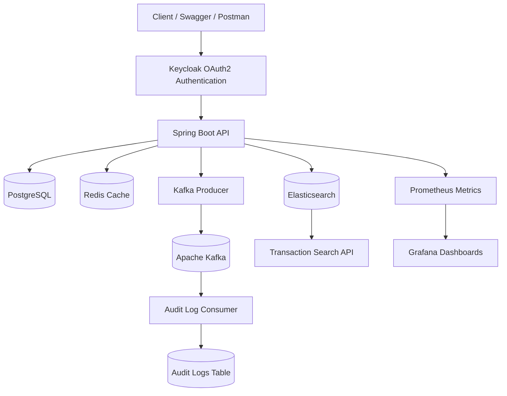
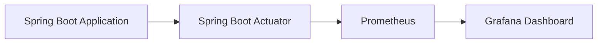

# Enterprise Digital Wallet Platform


Enterprise Digital Wallet Platform is a production-style backend application built using Spring Boot and PostgreSQL.

The project simulates a real-world digital wallet and payment infrastructure with enterprise backend engineering concepts such as:

* OAuth2 JWT authentication
* Event-driven architecture
* Distributed caching
* Search indexing
* Rate limiting
* Observability and monitoring
* Metrics collection
* Production-ready REST APIs
* Centralized exception handling
* Idempotent transactions
* Infrastructure integration

The application demonstrates how modern backend systems are designed using scalable and production-oriented architecture patterns.

---

# Features

## Core Wallet Features

* User onboarding
* Automatic wallet creation
* Deposit money
* Withdraw money
* Peer-to-peer transfers
* Wallet balance management
* Transaction history tracking
* Transaction status tracking
* Unique transaction reference numbers
* Idempotent transfer requests

---

# Enterprise Features

## Security

* Keycloak OAuth2 authentication
* JWT Bearer token authorization
* Role-based access control
* Stateless authentication
* Spring Security integration

## Caching

* Redis wallet caching
* Cache invalidation on updates
* Reduced database reads

## Event-Driven Architecture

* Kafka-based wallet events
* Asynchronous audit logging
* Event publishing and consumption
* Transaction event persistence

## Search

* Elasticsearch transaction indexing
* Transaction search APIs
* Indexed transaction documents
* Fast filtering and querying

## Monitoring And Observability

* Spring Boot Actuator
* Prometheus metrics
* Grafana dashboards
* JVM monitoring
* HTTP metrics
* Database pool metrics
* Security metrics
* Rate limiting metrics

## API Management

* Swagger/OpenAPI documentation
* Global exception handling
* Request validation
* DTO-based architecture
* Production-style REST APIs

## Infrastructure

* PostgreSQL persistence
* Dockerized local development
* Docker Compose orchestration
* Kafka infrastructure
* Redis infrastructure
* Elasticsearch infrastructure
* Keycloak identity management

---

# Tech Stack

## Backend

* Java 21
* Spring Boot
* Spring Web
* Spring Data JPA
* Spring Security
* Spring Validation
* Hibernate ORM
* Maven

## Security

* OAuth2 Resource Server
* JWT Authentication
* Keycloak

## Database

* PostgreSQL

## Search Engine

* Elasticsearch

## Messaging

* Apache Kafka

## Caching

* Redis

## Monitoring

* Spring Boot Actuator
* Prometheus
* Grafana
* Micrometer

## Infrastructure

* Docker
* Docker Compose

## API Documentation

* Swagger/OpenAPI

---

# System Architecture



---

# Monitoring Architecture



---

# Security

The platform uses OAuth2 Resource Server security with JWT Bearer tokens issued by Keycloak.

## Security Features

* JWT authentication
* OAuth2 authorization
* Role-based API access
* Stateless security
* Secure REST APIs
* Protected Actuator endpoints

## Roles

* ADMIN
* USER

---

# Rate Limiting

The platform implements Redis-backed rate limiting to prevent API abuse.

## Features

* Per-client request limiting
* Redis-based distributed storage
* HTTP 429 protection
* API throttling
* Monitoring integration

---

# Monitoring And Metrics

The platform exposes production-grade metrics using Spring Boot Actuator and Prometheus.

## Metrics Included

### JVM Metrics

* Heap memory
* GC activity
* Thread usage
* CPU usage

### HTTP Metrics

* Request counts
* Status codes
* Request latency
* Error tracking

### Database Metrics

* HikariCP pool metrics
* Active connections
* Idle connections

### Security Metrics

* Authentication success/failure
* Authorization metrics
* Bearer token validation

### Kafka Metrics

* Kafka producer metrics
* Kafka listener metrics

### Rate Limiting Metrics

* Blocked requests
* HTTP 429 tracking

---

# Grafana Dashboards

The project includes Grafana dashboards for:

* JVM monitoring
* API monitoring
* Security monitoring
* Database monitoring
* Request metrics
* Rate limiting metrics

---

# REST API Overview

## User APIs

### Create User

```http
POST /api/v1/users
```

### Get All Users

```http
GET /api/v1/users
```

### Get User By ID

```http
GET /api/v1/users/{userId}
```

---

## Wallet APIs

### Get Wallet By User ID

```http
GET /api/v1/wallets/users/{userId}
```

### Deposit Money

```http
POST /api/v1/wallets/users/{userId}/deposit
```

### Withdraw Money

```http
POST /api/v1/wallets/users/{userId}/withdraw
```

---

## Transaction APIs

### Transfer Money

```http
POST /api/v1/transactions/transfer
```

### Get Transaction History

```http
GET /api/v1/transactions/users/{userId}
```

### Get Transaction By ID

```http
GET /api/v1/transactions/{transactionId}
```

---

## Search APIs

### Search By Transaction Type

```http
GET /api/v1/search/transactions/type/{transactionType}
```

### Search By Status

```http
GET /api/v1/search/transactions/status/{status}
```

### Search By Reference Number

```http
GET /api/v1/search/transactions/reference/{referenceNumber}
```

### Search By Amount Range

```http
GET /api/v1/search/transactions/amount?minAmount=1&maxAmount=1000
```

---

## Audit APIs

### Get Audit Logs

```http
GET /api/v1/audit-logs
```

---

## Monitoring APIs

### Health Check

```http
GET /actuator/health
```

### Metrics

```http
GET /actuator/metrics
```

### Prometheus Metrics

```http
GET /actuator/prometheus
```

---

# Postman Collection

The complete Postman collection for all APIs is included in the project root folder.

Import the following file into Postman:

```text
enterprise-digital-wallet.postman_collection.json
```

The collection includes:

* Authentication APIs
* User APIs
* Wallet APIs
* Transaction APIs
* Search APIs
* Audit APIs
* Monitoring APIs
* Prometheus APIs

---

# Example API Requests

## Generate JWT Access Token

```bash
curl -X POST "http://localhost:8081/realms/wallet-realm/protocol/openid-connect/token" \
  -H "Content-Type: application/x-www-form-urlencoded" \
  -d "client_id=wallet-api" \
  -d "username=walletadmin" \
  -d "password=password" \
  -d "grant_type=password"
```

---

## Create User

```bash
curl -X POST "http://localhost:8080/api/v1/users" \
  -H "Authorization: Bearer ACCESS_TOKEN" \
  -H "Content-Type: application/json" \
  -d '{
        "fullName":"Siddhant Sharma",
        "email":"siddhant@example.com",
        "phoneNumber":"+491234567890"
      }'
```

---

## Deposit Money

```bash
curl -X POST "http://localhost:8080/api/v1/wallets/users/{userId}/deposit" \
  -H "Authorization: Bearer ACCESS_TOKEN" \
  -H "Content-Type: application/json" \
  -d '{
        "amount":100.00
      }'
```

---

## Transfer Money

```bash
curl -X POST "http://localhost:8080/api/v1/transactions/transfer" \
  -H "Authorization: Bearer ACCESS_TOKEN" \
  -H "Content-Type: application/json" \
  -d '{
        "senderUserId":"SENDER_USER_ID",
        "receiverUserId":"RECEIVER_USER_ID",
        "amount":150.00,
        "idempotencyKey":"unique-transfer-key-001"
      }'
```

---

# Local Development Setup

## 1. Clone Repository

```bash
git clone <repository-url>
cd enterprise-digital-wallet
```

---

## 2. Start Infrastructure

```bash
docker compose up -d
```

Verify containers:

```bash
docker ps
```

---

## 3. Run Spring Boot Application

### Linux / Mac

```bash
./mvnw spring-boot:run
```

### Windows PowerShell

```powershell
.\mvnw spring-boot:run
```

---

# Application URLs

## Backend API

```text
http://localhost:8080
```

## Swagger UI

```text
http://localhost:8080/swagger-ui/index.html
```

## OpenAPI Docs

```text
http://localhost:8080/v3/api-docs
```

## Prometheus

```text
http://localhost:9090
```

## Grafana

```text
http://localhost:3000
```

## Keycloak

```text
http://localhost:8081
```

## Elasticsearch

```text
http://localhost:9200
```

---

# Keycloak Setup

## Realm

```text
wallet-realm
```

## Test User

```text
username: walletadmin
password: password
```

---

# Project Structure

```text
src/main/java/com/example/enterprise_digital_wallet
│
├── config
├── controller
├── dto
├── entity
├── event
├── exception
├── repository
├── search
├── service
└── EnterpriseDigitalWalletApplication
```

---

# Design Principles Used

* Layered architecture
* DTO pattern
* Separation of concerns
* Transactional consistency
* Event-driven architecture
* Repository pattern
* RESTful API design
* Cache-aside pattern
* Search indexing
* Production-style entity modeling

---

# Future Improvements

## Distributed Systems

* Saga orchestration
* Event sourcing
* Distributed tracing

## DevOps

* CI/CD pipelines
* Kubernetes deployment
* Helm charts
* Docker image optimization

## Observability

* Centralized logging
* Alerting systems
* Distributed tracing dashboards

---

# Screenshots

Add screenshots here:

```text
docs/screenshots/swagger-ui.png
docs/screenshots/grafana-dashboard.png
docs/screenshots/prometheus-metrics.png
docs/screenshots/keycloak.png
docs/screenshots/postman-collection.png
```

---

# Author

Siddhant Sharma

* MSc Information Technology
* University of Stuttgart
* Backend Software Engineer with 2+ years of industry experience
