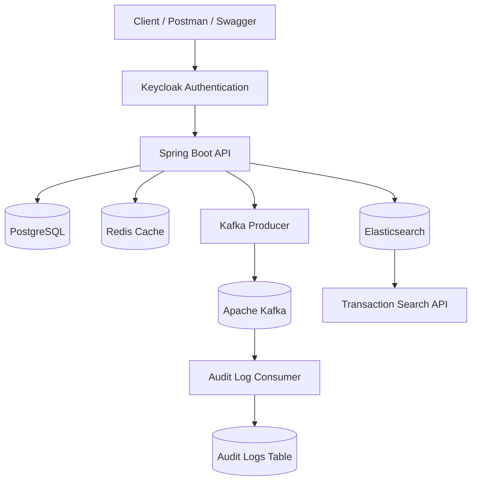
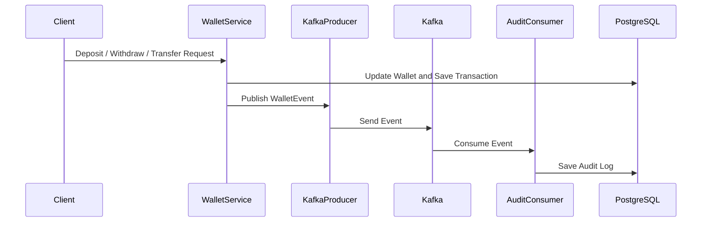
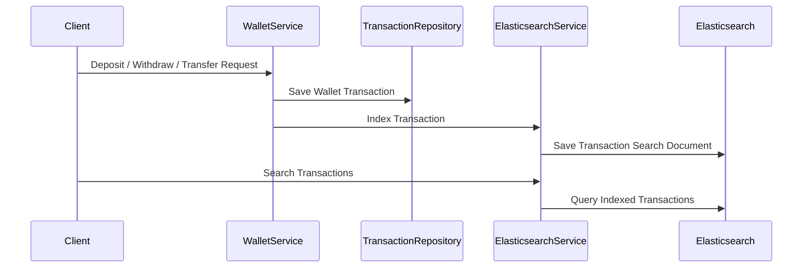
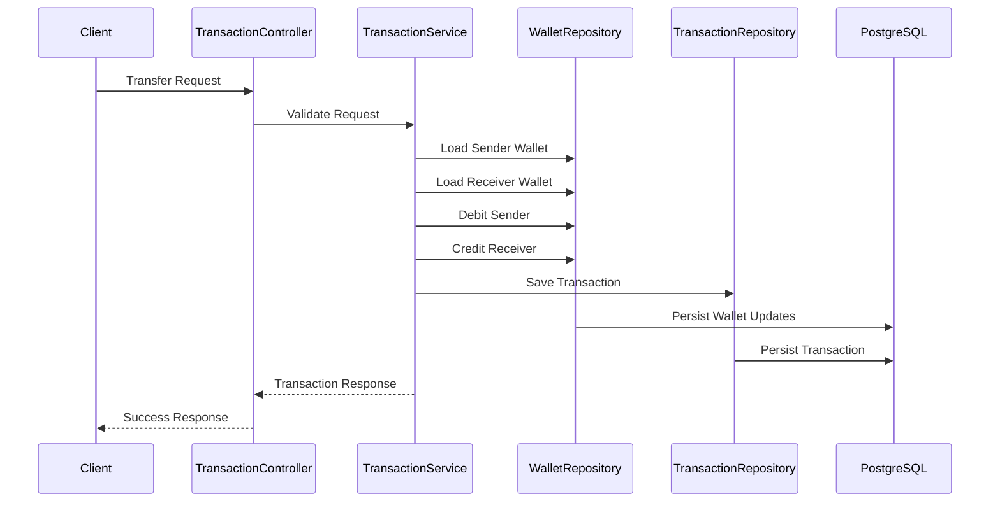
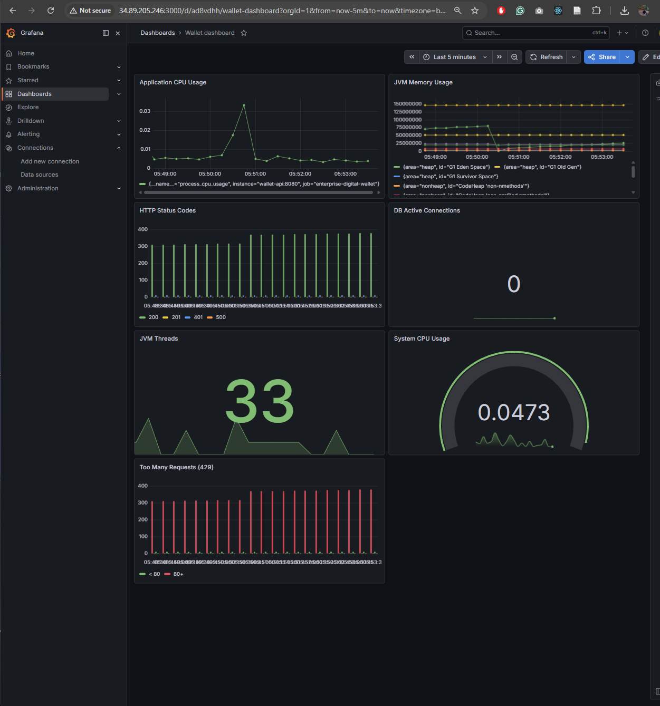
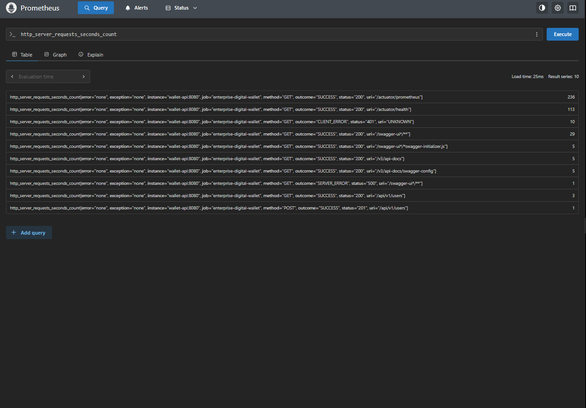
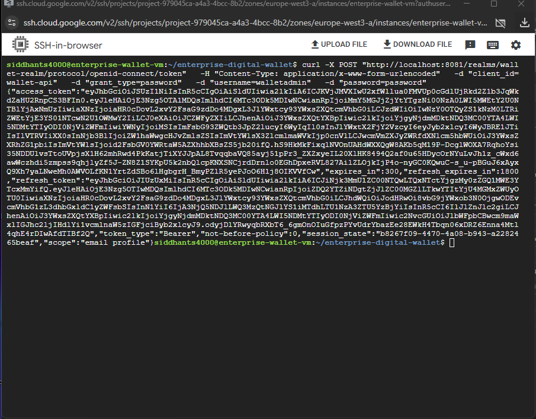
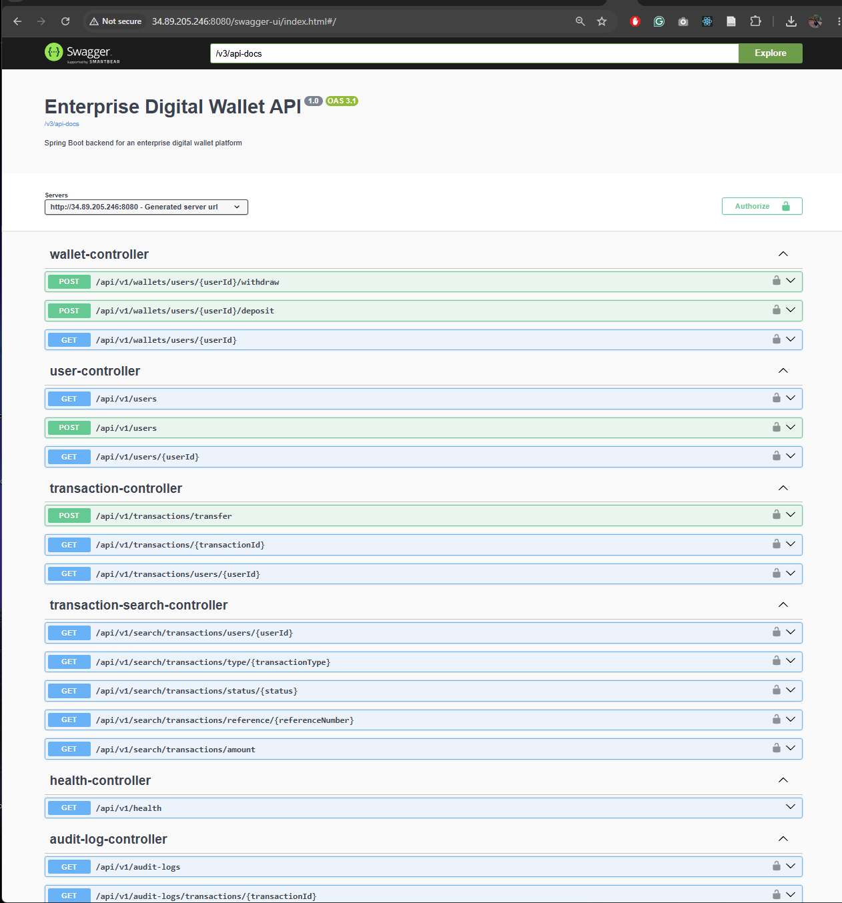

# Enterprise Digital Wallet Platform

Enterprise Digital Wallet Platform is a production-style backend application built using Spring Boot and PostgreSQL.

The project simulates a real-world digital wallet/payment system with support for:

- User onboarding
- Wallet management
- Deposits and withdrawals
- Peer-to-peer money transfers
- Transaction history tracking
- Kafka event-driven audit logging
- Redis caching
- Keycloak OAuth2 authentication
- Elasticsearch transaction search
- Validation and exception handling
- Dockerized local development

The primary goal of this project is to demonstrate enterprise backend engineering concepts using modern Java backend technologies and production-oriented architecture patterns.

---

# Tech Stack

## Backend

- Java 21
- Spring Boot
- Spring Web
- Spring Data JPA
- Spring Data Elasticsearch
- Hibernate ORM
- Spring Security
- OAuth2 Resource Server
- Maven

## Database

- PostgreSQL

## Search

- Elasticsearch

## Infrastructure

- Docker
- Docker Compose
- Apache Kafka
- Redis
- Keycloak

## Utilities

- Lombok
- Bean Validation
- OpenAPI / Swagger

---

# Current Enterprise Features

## User Module

- Create user
- Fetch user by ID
- Fetch all users

## Wallet Module

- Automatic wallet creation
- Fetch wallet by user ID
- Deposit money
- Withdraw money
- Balance validation

## Transaction Module

- Transfer money between users
- Transaction history by user
- Fetch transaction by ID
- Unique transaction reference numbers
- Transaction status tracking
- Transaction type tracking
- Idempotent transfer requests

## Audit Log Module

- Kafka-based event consumption
- Wallet event tracking
- Deposit audit logs
- Withdrawal audit logs
- Transfer audit logs
- Transaction event persistence
- Event timestamps

## Search Module

- Elasticsearch transaction indexing
- Transaction search by transaction type
- Indexed deposit transactions
- Indexed withdrawal transactions
- Indexed transfer transactions
- Direct Elasticsearch verification using the wallet-transactions index

## Security Features

- Keycloak OAuth2 authentication
- JWT-based authorization
- Role-based secured APIs
- Stateless authentication

## Platform Features

- Redis wallet caching
- Kafka event publishing
- Kafka event consumption
- Audit logging system
- Elasticsearch transaction search
- Global exception handling
- Request validation
- DTO-based architecture
- Layered service architecture
- PostgreSQL persistence
- Dockerized development setup

---

# Planned Enterprise Features

The project roadmap includes:

- Kibana dashboard for Elasticsearch data
- Netflix Conductor workflows
- Jenkins CI/CD pipeline
- Kubernetes deployment
- Prometheus monitoring
- Grafana dashboards
- Distributed tracing
- Rate limiting
- Saga orchestration
- Event sourcing

---

# System Architecture



---

# Kafka Event Flow



---

# Elasticsearch Indexing Flow



---

# High-Level Transaction Flow



---

# Project Structure

```text
src/main/java/com/example/enterprise_digital_wallet
│
├── config
│
├── controller
│   ├── HealthController
│   ├── UserController
│   ├── WalletController
│   ├── TransactionController
│   ├── AuditLogController
│   └── TransactionSearchController
│
├── dto
│
├── entity
│
├── event
│
├── exception
│
├── repository
│
├── search
│
├── service
│
└── EnterpriseDigitalWalletApplication
```

---

# Database Design

## Users Table

```text
users
├── id
├── full_name
├── email
├── phone_number
├── status
├── created_at
├── updated_at
```

## Wallets Table

```text
wallets
├── id
├── user_id
├── balance
├── currency
├── created_at
```

## Wallet Transactions Table

```text
wallet_transactions
├── id
├── sender_wallet_id
├── receiver_wallet_id
├── amount
├── currency
├── transaction_type
├── status
├── reference_number
├── idempotency_key
├── created_at
```

## Audit Logs Table

```text
audit_logs
├── id
├── event_type
├── transaction_id
├── sender_user_id
├── receiver_user_id
├── amount
├── currency
├── reference_number
├── occurred_at
├── consumed_at
```

---

# Elasticsearch Design

## Index

```text
wallet-transactions
```

## Indexed Transaction Document

```text
wallet-transactions
├── id
├── transaction_id
├── sender_user_id
├── receiver_user_id
├── amount
├── currency
├── transaction_type
├── status
├── reference_number
├── created_at
```

Elasticsearch is used to support transaction search and fast filtering without relying only on PostgreSQL queries.

---

# Security

The platform uses Keycloak OAuth2 authentication with JWT Bearer tokens.

## Features

- OAuth2 Resource Server
- JWT validation
- Role-based authorization
- Secure REST APIs
- Stateless authentication

## Roles

- ADMIN
- USER

---

# REST API Overview

# Health APIs

## Check Application Health

```http
GET /api/v1/health
```

---

# User APIs

## Create User

```http
POST /api/v1/users
```

## Get All Users

```http
GET /api/v1/users
```

## Get User By ID

```http
GET /api/v1/users/{userId}
```

---

# Wallet APIs

## Get Wallet By User ID

```http
GET /api/v1/wallets/users/{userId}
```

## Deposit Money

```http
POST /api/v1/wallets/users/{userId}/deposit
```

## Withdraw Money

```http
POST /api/v1/wallets/users/{userId}/withdraw
```

---

# Transaction APIs

## Transfer Money

```http
POST /api/v1/transactions/transfer
```

## Get Transaction History By User

```http
GET /api/v1/transactions/users/{userId}
```

## Get Transaction By ID

```http
GET /api/v1/transactions/{transactionId}
```

---

# Audit Log APIs

## Get All Audit Logs

```http
GET /api/v1/audit-logs
```

---

# Search APIs

## Search Transactions By Type

```http
GET /api/v1/search/transactions/type/{transactionType}
```

Example transaction types:

```text
DEPOSIT
WITHDRAWAL
TRANSFER
```

---

# Example API Requests

# Generate Access Token

```bash
curl -X POST "http://localhost:8081/realms/wallet-realm/protocol/openid-connect/token" \
  -H "Content-Type: application/x-www-form-urlencoded" \
  -d "client_id=wallet-api" \
  -d "username=walletadmin" \
  -d "password=password" \
  -d "grant_type=password"
```

---

# Create User

```bash
curl -X POST "http://localhost:8080/api/v1/users" \
  -H "Authorization: Bearer ACCESS_TOKEN" \
  -H "Content-Type: application/json" \
  -d '{
        "fullName":"Siddhant Sharma",
        "email":"siddhant@example.com",
        "phoneNumber":"+491234567890"
      }'
```

---

# Deposit Money

```bash
curl -X POST "http://localhost:8080/api/v1/wallets/users/{userId}/deposit" \
  -H "Authorization: Bearer ACCESS_TOKEN" \
  -H "Content-Type: application/json" \
  -d '{
        "amount":100.00
      }'
```

---

# Withdraw Money

```bash
curl -X POST "http://localhost:8080/api/v1/wallets/users/{userId}/withdraw" \
  -H "Authorization: Bearer ACCESS_TOKEN" \
  -H "Content-Type: application/json" \
  -d '{
        "amount":50.00
      }'
```

---

# Transfer Money

```bash
curl -X POST "http://localhost:8080/api/v1/transactions/transfer" \
  -H "Authorization: Bearer ACCESS_TOKEN" \
  -H "Content-Type: application/json" \
  -d '{
        "senderUserId":"SENDER_USER_ID",
        "receiverUserId":"RECEIVER_USER_ID",
        "amount":150.00,
        "idempotencyKey":"unique-transfer-key-001"
      }'
```

---

# Get Audit Logs

```bash
curl -X GET "http://localhost:8080/api/v1/audit-logs" \
  -H "Authorization: Bearer ACCESS_TOKEN"
```

---

# Search Transactions By Type

```bash
curl -X GET "http://localhost:8080/api/v1/search/transactions/type/DEPOSIT" \
  -H "Authorization: Bearer ACCESS_TOKEN"
```

---

# Direct Elasticsearch Verification

```bash
curl "http://localhost:9200/wallet-transactions/_search?pretty"
```

---

# Redis Caching

Redis is used for wallet-level caching to reduce repeated database reads.

## Cached Operations

- Fetch wallet by user ID

## Cache Eviction

Wallet cache is automatically invalidated on:

- Deposit
- Withdrawal
- Money transfer

---

# Kafka Event-Driven Audit Logging

Kafka is used to publish wallet transaction events.

## Published Events

- MONEY_DEPOSITED
- MONEY_WITHDRAWN
- MONEY_TRANSFERRED

## Consumer Responsibility

The Kafka consumer listens to wallet events and persists them as audit logs in PostgreSQL.

---

# Elasticsearch Transaction Search

Elasticsearch is used to index transaction data for search use cases.

## Indexed Transactions

- Deposits
- Withdrawals
- Transfers

## Search Use Cases

- Search by transaction type
- Inspect indexed transactions directly
- Prepare for future filtering by amount, status, user ID, reference number, and date range

---

# Local Development Setup

# 1. Clone Repository

```bash
git clone <repository-url>
cd enterprise-digital-wallet
```

---

# 2. Start Infrastructure

```bash
docker compose up -d
```

Verify running containers:

```bash
docker ps
```

---

# 3. Run Spring Boot Application

## Linux / Mac

```bash
./mvnw spring-boot:run
```

## Windows PowerShell

```powershell
.\mvnw spring-boot:run
```

---

# Keycloak Setup

Keycloak runs on:

```text
http://localhost:8081
```

## Realm

```text
wallet-realm
```

## Test User

```text
username: walletadmin
password: password
```

---

# Application URLs

## Backend API

```text
http://localhost:8080
```

## Swagger UI

```text
http://localhost:8080/swagger-ui/index.html
```

## OpenAPI Docs

```text
http://localhost:8080/v3/api-docs
```

## Keycloak

```text
http://localhost:8081
```

## Elasticsearch

```text
http://localhost:9200
```

---

# Database Configuration

```properties
spring.datasource.url=jdbc:postgresql://localhost:5433/wallet_db
spring.datasource.username=wallet_user
spring.datasource.password=wallet_password
```

---

# Elasticsearch Configuration

```properties
spring.elasticsearch.uris=http://localhost:9200
```

---

# Exception Handling

The application uses centralized global exception handling for:

- Validation failures
- Resource not found errors
- Insufficient balance errors
- Invalid transaction errors
- Authentication errors
- Internal server errors

---

# Validation Rules

## User Validation

- Email must be unique
- Phone number must be unique
- Full name cannot be blank

## Transaction Validation

- Amount must be greater than zero
- Sender and receiver cannot be same
- Sender must have sufficient balance
- Idempotency key should be unique for transfer requests

---

# Design Principles Used

- Layered architecture
- DTO pattern
- Separation of concerns
- Transactional consistency
- Repository pattern
- RESTful API design
- Exception-driven validation
- Event-driven architecture
- Search indexing
- Cache-aside pattern
- Production-style entity modeling

---

# Future Improvements

## Distributed Systems

- Saga orchestration
- Event sourcing
- Distributed tracing

## Observability

- Prometheus metrics
- Grafana dashboards
- Centralized logging
- Health monitoring

## DevOps

- Jenkins CI/CD pipeline
- Kubernetes deployment
- Helm charts
- Docker image optimization

## Search And Analytics

- Kibana dashboard
- Search by transaction status
- Search by user ID
- Search by reference number
- Date range filtering
- Amount range filtering

---


---

# Production Cloud Deployment

The platform is fully deployed on a Google Cloud VM using Docker Compose and production-style infrastructure tooling.

## Live Cloud Services

| Service | URL |
|---|---|
| Backend API | http://34.89.205.246:8080 |
| Swagger UI | http://34.89.205.246:8080/swagger-ui/index.html |
| Prometheus | http://34.89.205.246:9090 |
| Grafana | http://34.89.205.246:3000 |

---

# Cloud Infrastructure Stack

The cloud deployment includes:

- Google Cloud Compute Engine VM
- Docker Engine
- Docker Compose
- Spring Boot API
- PostgreSQL
- Redis
- Apache Kafka
- Elasticsearch
- Keycloak
- Prometheus
- Grafana

---

# Monitoring And Observability Dashboard

The platform includes production-style observability using:

- Spring Boot Actuator
- Micrometer
- Prometheus
- Grafana

## Monitored Metrics

- JVM memory usage
- CPU usage
- HTTP request metrics
- HTTP status codes
- Active database connections
- JVM thread monitoring
- System-level resource monitoring

---

# Deployment Screenshots

## Grafana Dashboard



---

## Prometheus Metrics



---

## Keycloak Authentication



---

## Swagger API Documentation



---

# Google Cloud VM Setup

## Install Docker

```bash
sudo apt update

sudo apt install -y docker.io docker-compose git

sudo systemctl enable docker
sudo systemctl start docker

sudo usermod -aG docker $USER
newgrp docker
```

---

## Clone Repository

```bash
git clone https://github.com/siddhants4000/enterprise-digital-wallet.git

cd enterprise-digital-wallet
```

---

## Start Complete Infrastructure

```bash
docker compose up -d
```

---

## Start Wallet API

```bash
docker compose up -d wallet-api
```

---

## Verify Running Containers

```bash
docker ps
```

---

## Verify Health Endpoint

```bash
curl http://localhost:8080/actuator/health
```

---

## Verify Prometheus Metrics

```bash
curl http://localhost:8080/actuator/prometheus
```

---

# Public API Testing

## Generate Access Token

```bash
curl -X POST "http://localhost:8081/realms/wallet-realm/protocol/openid-connect/token" \
  -H "Content-Type: application/x-www-form-urlencoded" \
  -d "client_id=wallet-api" \
  -d "grant_type=password" \
  -d "username=walletadmin" \
  -d "password=password"
```

---

## Example Authenticated API Call

```bash
curl -X GET "http://34.89.205.246:8080/api/v1/users" \
  -H "Authorization: Bearer ACCESS_TOKEN"
```

---

# Kubernetes Deployment Verification

## Verify Pods

```powershell
kubectl get pods -n wallet
```

## Verify Services

```powershell
kubectl get svc -n wallet
```

## Verify Helm Release

```powershell
helm list -n wallet
```

---

# Grafana Dashboard Features

The Grafana dashboard visualizes:

- Application CPU usage
- JVM heap and non-heap memory
- HTTP response codes
- Database connection pool metrics
- JVM thread activity
- System CPU usage
- API traffic patterns

---

# CI/CD And Automation

The project includes:

- GitHub Actions CI pipeline
- Dockerized deployment workflow
- Helm-based Kubernetes deployment
- Terraform infrastructure provisioning
- Monitoring and observability setup

---

# Enterprise Engineering Concepts Demonstrated

This project demonstrates:

- Enterprise Spring Boot architecture
- Event-driven architecture using Kafka
- Redis caching strategies
- Elasticsearch indexing and search
- OAuth2 authentication with Keycloak
- Docker containerization
- Kubernetes orchestration
- Helm package management
- Terraform Infrastructure as Code
- Prometheus metrics scraping
- Grafana dashboard visualization
- Production-style deployment workflows


# Author

Siddhant Sharma

- MSc Information Technology
- University of Stuttgart
- Backend Software Engineer with 2+ years of industry experience


---

# Kubernetes Deployment

The platform supports Kubernetes-based deployment using Docker Desktop Kubernetes or any Kubernetes cluster.

## Kubernetes Components

- PostgreSQL Deployment and Service
- Redis Deployment and Service
- Elasticsearch Deployment and Service
- Kafka Deployment and Service
- Wallet API Deployment and Service

## Verify Kubernetes Resources

```powershell
kubectl get all -n wallet
```

## Access Wallet API

```text
http://localhost:30080
```

---

# Helm Deployment

The project includes Helm charts for simplified Kubernetes deployment and release management.

## Helm Features

- Parameterized deployments
- Reusable Kubernetes templates
- Environment-based configuration
- Centralized values.yaml configuration

## Helm Commands

### Install Helm Release

```powershell
helm install wallet-platform ./helm/wallet-platform -n wallet
```

### Upgrade Helm Release

```powershell
helm upgrade wallet-platform ./helm/wallet-platform -n wallet
```

### Uninstall Helm Release

```powershell
helm uninstall wallet-platform -n wallet
```

## Verify Helm Release

```powershell
helm list -n wallet
```

---

# Terraform Infrastructure Provisioning

The project supports Infrastructure as Code (IaC) using Terraform.

Terraform provisions:

- Kubernetes namespace
- Helm deployment for the wallet platform

## Terraform Commands

```powershell
cd terraform

terraform init
terraform plan
terraform apply
```

## Verify Terraform Deployment

```powershell
kubectl get pods -n wallet

helm list -n wallet
```

## Destroy Infrastructure

```powershell
terraform destroy
```

---

# CI/CD Pipeline

The project includes GitHub Actions based CI/CD automation.

## CI/CD Features

- Maven build validation
- Docker image build validation
- Helm chart linting
- Helm template rendering
- Automated GitHub workflow execution

## GitHub Actions Workflow

Location:

```text
.github/workflows/build.yml
```

## CI Pipeline Steps

- Checkout repository
- Setup Java 21
- Build Spring Boot application
- Build Docker image
- Validate Helm charts
- Render Helm templates

---

# Monitoring And Observability

The platform supports production-style monitoring using Prometheus and Grafana.

## Monitoring Features

- Spring Boot Actuator metrics
- Prometheus metrics scraping
- Grafana dashboards
- JVM monitoring
- HTTP request monitoring
- API response monitoring

## Monitoring Stack

- Prometheus
- Grafana
- Spring Boot Actuator
- Micrometer

---

# Postman Collection

The project includes a Postman collection for API testing.

Location:

```text
Project Root Folder
```

The Postman collection contains:

- Authentication APIs
- User APIs
- Wallet APIs
- Transaction APIs
- Audit Log APIs
- Search APIs

---

# Complete Deployment Flow

## Local Development

```powershell
docker compose up -d
.\mvnw spring-boot:run
```

## Docker Deployment

```powershell
docker build -t enterprise-wallet-app .
docker run -p 8080:8080 enterprise-wallet-app
```

## Kubernetes Deployment

```powershell
kubectl apply -f k8s/
```

## Helm Deployment

```powershell
helm install wallet-platform ./helm/wallet-platform -n wallet
```

## Terraform Deployment

```powershell
cd terraform
terraform init
terraform apply
```
